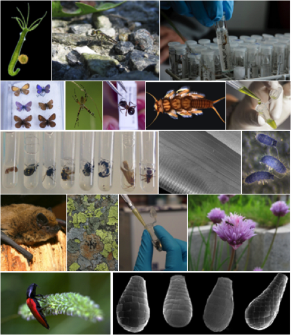

# The Swiss Barcode of Life

SwissBOL is a project initiated by the Federal Office for the Environment for the centralization and dissemination of genetic data on biodiversity hosted in Switzerland.​

  

> SwissBOL is the Swiss initiative of genetic inventory of the biodiversity.

> SwissBOL is a network of specialists and Swiss
institutions involved in the genetic cataloguing of the
species.

> SwissBOL is a non-profit association that aims for the central coordination of the activities related to the documentation of the genetic diversity in Switzerland.

### Partners

- GBIF.ch
- Info fauna - CSCF
- Université de Genève
- Conservatoire et jardin botaniques de Genève
- Musée Cantonal de Zoologie de Lausanne
- Museum d’Histoire Naturelle de Genève
- Université de Neuchâtel
- WSL
