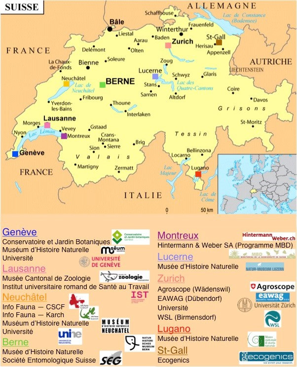

Since 2012, SwissBOL has developed an active network of scientific partners specialized in each taxonomic group. According to its decentralized structure, SwissBOL brings together Swiss institutions involved in biodiversity research. Representatives of natural history museums, botanical gardens, universities, academic and research institutes, data centres, associations and specialist societies, as well as private scientific societies contribute to SwissBOL's mission.

National programs of Barcode Of Life

ABOL  - Austrian Barcode of Life
BeBOL  - Belgian Network for DNA Barcoding
FINBOL - Finnish Barcode of Life project
GBOL - German Barcode of Life
NORBOL - Norwegian Barcode of Life

## Institutions involved

Cooperating Swiss institutions

- OFEV
- GBIF Swiss Node
- Info Species
- SCNAT – Plateforme Biologie
- SSS - Swiss Systematics Society

## Scientists associated

- Aebi Alexandre
- Alvarez Nadir
- Andriollo Tommy
- Apothéloz-Perret-Gentil Laure
- Belbahri Lassaad
- Bernasconi Marco
- Blanckenhorn Wolf
- Blanc Mickaël
- Birrer Stefan
- Buser Andreas
- Chittaro Yannick
- Cibois Alice
- Forini Isa
- Fournier Bertrand
- Frey Juerg
- Gattolliat Jean-Luc
- Germann Christoph
- Glaizot Olivier
- Gonseth Yves
- Grant Jason
- Gueuning Morgan
- Heger Thierry
- Kiewnick Sebastian
- Kosakyan Anush
- Kropf Christian
- Lara Enrique
- Lasut Liana
- Le Bayon Claire
- Litman Jessica
- Mitchell Edward
- Montoya Juan
- Naciri Yamama
- Nentwig Wolfgang
- Neumeyer Rainer
- Niculita-Hirzel Hélène
- Pawlowski Jan
- Perret Mathieu
- Pollini Lucia
- Praz Christophe
- Price Michelle
- Rohner Patrick
- Rossi-Pedruzzi Anya
- Ruedi Manuel
- Sartori Michel
- Scheidegger Christoph
- Schuchert Peter
- Senn-Irlet Beatrice
- Singer David
- Spasojevic Tamara
- Stucki Pascal
- Thiébaud Jacques
- Tschudin Pascal
- Ungricht Stefan
- Vivien Régis
- Vuataz Laurent
- Wyler Sofia
- Yvon Candice
- Zigerli David
